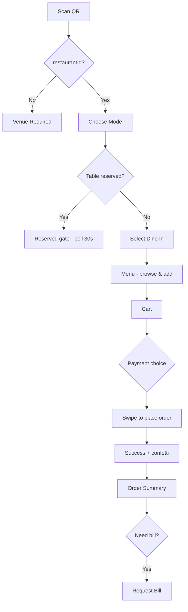
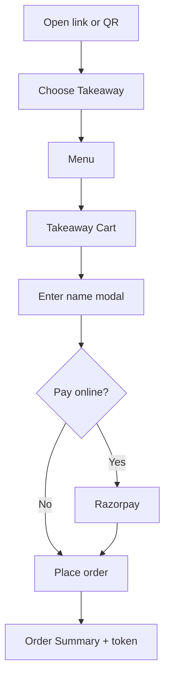
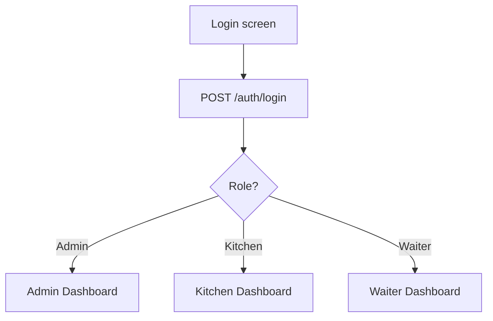

# Flow Diner / Webfront — Mobile App Design Specification

> **Purpose:** Complete UI/UX, flow, data, and integration reference for building a native or React Native mobile app that matches the existing web frontend (`webfront/`).  
> **Source of truth:** React 18 + Vite + Tailwind CSS 4 + Framer Motion + Lucide icons + Socket.io.  
> **Related docs:** [`FRONTEND_DOCS.md`](./FRONTEND_DOCS.md) (architecture & API), `src/routes/index.jsx` (routes).  
> **Last synced from codebase:** June 2026

---

## Table of Contents

1. [Product Overview](#1-product-overview)
2. [Personas & Module Scope](#2-personas--module-scope)
3. [Complete Route Map](#3-complete-route-map)
4. [Design Identity & Tokens](#4-design-identity--tokens)
5. [Global Components](#5-global-components)
6. [Mobile Navigation Architecture](#6-mobile-navigation-architecture)
7. [Customer Screens (P0 — Detailed)](#7-customer-screens-p0--detailed)
8. [Staff Screens (P1–P2)](#8-staff-screens-p1p2)
9. [User Flows](#9-user-flows)
10. [Data Models](#10-data-models)
11. [API Integration](#11-api-integration)
12. [Tenant Bootstrap & Storage](#12-tenant-bootstrap--storage)
13. [Real-Time (Socket.io)](#13-real-time-socketio)
14. [Feature Flags](#14-feature-flags)
15. [Payment Flows](#15-payment-flows)
16. [States, Errors & Edge Cases](#16-states-errors--edge-cases)
17. [Animations & Native Affordances](#17-animations--native-affordances)
18. [React Native Implementation Map](#18-react-native-implementation-map)
19. [Assets & Breakpoints](#19-assets--breakpoints)
20. [Accessibility & Copy Tone](#20-accessibility--copy-tone)
21. [QA Checklist](#21-qa-checklist)
22. [Phased Rollout Plan](#22-phased-rollout-plan)

---

## 1. Product Overview

**Flow Diner** is a **multi-tenant restaurant SaaS** platform. One deployment serves multiple restaurants, each isolated by `restaurantId`. Customers order via QR menu; staff run operations via role-based panels.

| Aspect | Detail |
|--------|--------|
| **Currency** | Indian Rupee (`₹`) |
| **Tax** | GST split CGST/SGST via `utils/gstRates.js` |
| **Tenancy** | `restaurantId` from QR URL scopes all data, cache, branding |
| **White-label** | Per-tenant colors, logo, font, light/dark theme |
| **Payments** | Razorpay (customer checkout + platform subscriptions) |
| **Printing** | Thermal receipts, KOT, RestoPrint connector (web/admin) |

### 1.1 QR URL format

```
https://{host}/menu?restaurantId=RESTO001&table=3
https://{host}/menu?restaurantId=RESTO001&mode=takeaway
```

Mobile deep link equivalent:

```
flowdiner://menu?restaurantId=RESTO001&table=3
```

---

## 2. Personas & Module Scope

| Persona | Web prefix | Auth | Primary mobile priority |
|---------|------------|------|-------------------------|
| **Customer** | `/menu`, `/cart`, … | None (public) | **P0** |
| **Waiter** | `/waiter/*` | JWT + `isWaiterLoggedIn` | **P1** |
| **Kitchen** | `/kitchen/*` | JWT + `isKitchenLoggedIn` | **P1** |
| **Restaurant Admin** | `/admin/*` | JWT + `isAdminLoggedIn` | **P2** (simplified) |
| **HR Manager** | `/hr/*` | `hrToken` | **P3** (web-first) |
| **Super Admin** | `/superadmin/*` | `role === superadmin` | **P3** (web-only) |
| **Support Team** | `/support-team/*` | JWT + `isSupportLoggedIn` | **P3** (web-only) |

---

## 3. Complete Route Map

### 3.1 Customer (no auth, `CustomerLayout`)

| Route | Component | Navbar visible | Purpose |
|-------|-----------|----------------|---------|
| `/` | redirect | — | → `/menu` |
| `/menu` | `Menu.jsx` | Yes | Browse menu, search, filter, add to cart |
| `/cart` | `Cart.jsx` | Yes | Dine-in checkout, swipe-to-order |
| `/takeaway-cart` | `TakeawayCart.jsx` | Yes | Takeaway checkout (wraps Cart `hideTable`) |
| `/choose-mode` | `ChooseMode.jsx` | **No** | Dine-in vs takeaway selection |
| `/order-status/:orderId` | `OrderStatus.jsx` | Yes | Single-order tracking |
| `/order-summary` | `OrderSummary.jsx` | Yes | Table/takeaway order history |

**Gate:** Without `restaurantId`, show “Venue link required” empty state.

### 3.2 Staff login (shared)

| Route | Component | Purpose |
|-------|-----------|---------|
| `/login` | `Login.jsx` | Admin/kitchen/waiter login + forgot-password OTP |

### 3.3 Admin (`/admin/*`, `ProtectedRoute`)

| Route | Feature flag | Purpose |
|-------|--------------|---------|
| `dashboard` | — | Live ops dashboard |
| `orders` | `onlineOrders` | Live order board |
| `manual-order` | `onlineOrders` | Staff-created orders |
| `bill`, `manual-bill` | — | Invoice center |
| `kitchen-bill` | `kitchenPanel` | KOT display |
| `products`, `products/add`, `products/edit/:id` | — | Menu CRUD |
| `sub-items` | — | Add-on library |
| `tables` | `qrMenu` | Table layout |
| `qr-generator` | `qrMenu` | QR codes |
| `reservations` | `reservations` | Reservations |
| `tokens` | — | Takeaway token queue |
| `banner`, `offers` | — | Promotions |
| `analytics`, `reports` | `reports` | Analytics |
| `accounting/*` | `accounting` | Ledgers, transactions |
| `hr/*` | HR flags | Embedded HR |
| `subscription`, `payment-settings`, `profile`, `customer` | varies | Settings & support |

### 3.4 Kitchen (`/kitchen/*`)

`dashboard`, `orders`, `kot`, `kitchen-bill`, `bill`, `attendance`, `attendance-history`, `leaves`

### 3.5 Waiter (`/waiter/*`)

`dashboard`, `tables`, `products`, `panel` (cart), `order-summary`, `orders`, `bill`, `kitchen-bill`, `reservations`, `qr-generator`, `attendance*`, `leaves`

### 3.6 HR (`/hr/*`)

`login`, `portal`, `dashboard`, `staff`, `attendance`, `leaves`, `shifts`, `payroll`

### 3.7 Super Admin & Support

Platform tenant management, plans, analytics, payment settings, support tickets.

---

## 4. Design Identity & Tokens

### 4.1 Visual language

- **Style:** Premium dining — bold uppercase headings, tight tracking, high contrast black/white cards, soft slate backgrounds.
- **Shape language:** Large rounded corners (`12px` → `32px` on cards), pill badges, circular icon buttons.
- **Density:** Mobile-first on customer flows; admin/staff use drawer sidebar on phone, expanded sidebar on tablet.
- **Motion:** Spring tab indicators, fade/slide modals, shared-element transitions, loader blur exit.

### 4.2 Brand defaults (before tenant override)

| Token | CSS variable | Default | Usage |
|-------|--------------|---------|-------|
| Primary | `--primary` | `#f72585` | Accent, CTAs (tenant-overridable) |
| Secondary | `--secondary` | `#0f172a` | Dark surfaces, active nav |
| Accent | `--accent` | `#7209b7` | Secondary accent |
| Font | `--font` | `Inter` | Body |
| Sidebar bg | — | `#ffffff` | Admin sidebar |
| Sidebar text | — | `#1e293b` | Admin sidebar labels |

**Supported fonts:** Inter, Poppins, Roboto, Nunito, Lato, Montserrat.

**Dark mode:** `body.dark` → background `#0f172a`, text `#f1f5f9` when `branding.theme === "dark"`.

### 4.3 Neutral palette

| Role | Tailwind | Hex |
|------|----------|-----|
| Page background | `bg-slate-50` | `#f8fafc` |
| Card surface | `bg-white` | `#ffffff` |
| Primary text | `text-slate-900` | `#0f172a` |
| Secondary text | `text-slate-500` | `#64748b` |
| Borders | `border-slate-100` | light gray |
| Success / live | `emerald-500` | `#10b981` |
| Warning | `amber-400`–`600` | reservations, waiter call |
| Error / sold out | `rose-600` | `#e11d48` |
| Stock label | `indigo-600` | “X left” |

### 4.4 Typography scale

| Element | Web classes | Mobile size |
|---------|-------------|-------------|
| Hero title | `text-4xl/5xl font-black uppercase italic tracking-tight` | 36–48px |
| Screen title | `text-2xl font-black uppercase tracking-tighter` | 24px |
| Section label | `text-[10px] font-black uppercase tracking-[0.2em] text-slate-400` | 10px |
| Card title | `text-lg font-black uppercase` | 14–18px |
| Body | `text-sm font-medium` | 13–14px |
| Price | `font-black tabular-nums` + `₹` | 13–20px |
| Micro CTA | `text-[9px]–[11px] font-black uppercase tracking-widest` | 9–11px |

**Font weights:** 400 body, 500–600 semibold, 700–900 black headings.

### 4.5 Spacing & layout

| Token | Value | Usage |
|-------|-------|-------|
| Screen horizontal padding | 16px (`px-4`), 24px sm+ | All screens |
| Card padding | 12px mobile → 24px desktop | Product cards |
| Bottom nav height | 74–80px + safe area | Customer tabs |
| Main scroll bottom padding | 96px (`pb-24`) | Under fixed bottom nav |
| Max content width | 1280px customer, 448px chooser | Centered layouts |

### 4.6 Radius & elevation

| Component | Radius | Shadow |
|-----------|--------|--------|
| Primary buttons | 12px (`rounded-xl`) | `shadow-sm` |
| Cards | 24–32px | `hover:shadow-2xl` |
| Modals | 24px (`rounded-3xl`) | `shadow-2xl` |
| Icon containers | 12–16px | `shadow-md` |
| Pills / badges | `rounded-full` | — |
| Search field | 16px (`rounded-2xl`) | focus ring |

### 4.7 Iconography

- **Library:** Lucide (`strokeWidth` 2 inactive, 2.5 active).
- **Common:** `Utensils`, `ShoppingCart`, `Receipt`, `ChefHat`, `Bell`, `HandHelping`, `Phone`, `Table`, `Package`, `Search`, `Plus`, `Minus`.

### 4.8 Food type indicator (India standard)

| Type | Visual |
|------|--------|
| **Veg** | Green border square (14×14px) + green dot inside |
| **Non-veg** | Red border square + red dot |

---

## 5. Global Components

### 5.1 Buttons

| Variant | Style | Usage |
|---------|-------|-------|
| **Primary solid** | `bg-black text-white font-black uppercase tracking-widest` | Add to cart, “Got it” |
| **Primary theme** | `bg-slate-900 text-white rounded-xl` | Active nav pill |
| **Secondary outline** | `border-2 border-black`, hover invert | Choose Mode cards |
| **Ghost icon** | `rounded-full bg-slate-50 border border-slate-100` | Bill, Call waiter, Offers |
| **Disabled** | `opacity-50–60 bg-slate-100` | Cooldown, sold out |

**Touch:** `touch-manipulation`, `active:scale-[0.98]` on large targets. Minimum tap target: **44×44pt**.

### 5.2 ProductCard

```
┌─────────────────────────────┐
│  [veg/non-veg]    image 16:10│
│  (sold out overlay if needed)│
├─────────────────────────────┤
│  PRODUCT NAME        ₹price │
│  description (3 lines max)  │
│  [Read more]                │
│  "X left" (if stock tracked)│
├─────────────────────────────┤
│  [  ADD  ]  or  [- | qty | +]│
└─────────────────────────────┘
```

| Property | Spec |
|----------|------|
| Image aspect | 16:10 mobile, 1:1 tablet+ |
| Sold out | Grayscale image + rose “SOLD OUT” banner overlay |
| Description | 3-line clamp; “Read more” if >80 chars |
| Qty stepper | 3-column grid, `border-2 border-black`, height 40–48px |
| Customisation | Opens `SubItemModal` when `hasPortions` or `addonGroups` |

**Stock rules:** `canAddProductQty()` blocks over-limit adds; toast on error.

### 5.3 SubItemModal (customisation sheet)

Bottom sheet / full-screen modal (Swiggy/Zomato style):

| Section | Behavior |
|---------|----------|
| **Portions** | Radio list; first available pre-selected |
| **Addon groups** | Toggle per group; respects `min`/`max` per group |
| **Quantity** | Stepper capped by `maxQty` (remaining stock) |
| **Price** | `(portionPrice + addonsTotal) × qty` live update |
| **CTA** | “Add to cart — ₹{total}” black button |

### 5.4 StatusBadge

| Status | Background | Text |
|--------|------------|------|
| Pending | `yellow-100` | `yellow-700` |
| New | `blue-100` | `blue-700` |
| Preparing | `orange-100` | `orange-700` |
| Ready | `green-100` | `green-700` |
| Served | `gray-200` | `gray-600` |
| Closed/Cancelled | `gray-100` | `gray-500` |

Pill: `px-3 py-1 rounded-full text-xs font-medium`.

### 5.5 RestaurantLoader (splash)

| Property | Value |
|----------|-------|
| Background | `#fafafa` |
| Orbs | Animated orange/rose gradient blurs |
| Center plate | 160×160 white circle, `UtensilsCrossed` + `ChefHat` |
| Text | Letter-by-letter “Preparing your feast” |
| Duration | 1.5s on first menu visit per restaurant |
| Exit | Blur fade |
| Storage key | `hasSeenMenuLoader_{restaurantId}` |

### 5.6 OfferModal

| Property | Value |
|----------|-------|
| Auto-open | 6s after load if offers exist, first session only |
| Carousel | 5s per slide with progress bar |
| Close animation | “Flies” to bell icon |
| Re-open | Navbar bell → `showOfferModal` event |
| After close | Red dot on bell (`offerViewed` event) |
| Empty state | “No Offers Right Now” modal |

### 5.7 Toasts

- **Library:** `react-hot-toast` → mobile: `react-native-toast-message`
- **Triggers:** Cart errors, login, OTP, bill request, payment failure

### 5.8 TakeawayCustomerNameModal

- Shown before takeaway checkout
- Field: customer name (required for queue/token)
- Confirm → proceeds to place order or Razorpay

---

## 6. Mobile Navigation Architecture

### 6.1 Customer shell

```
┌──────────────────────────────────┐
│ [logo] RESTAURANT NAME  Bill Wait Offers │  ← sticky top (md:hidden)
├──────────────────────────────────┤
│           Screen content          │
│         (scroll, pb-24)           │
├──────────────────────────────────┤
│  Menu  |  Cart  |  Orders        │  ← fixed bottom tab bar + safe area
└──────────────────────────────────┘
```

| Tab | Route | Icon | Active state |
|-----|-------|------|--------------|
| Menu | `/menu` | `Utensils` | Slate-900 icon, `bg-slate-50` pill, top accent bar |
| Cart | `/cart` | `ShoppingCart` | Same |
| Orders | `/order-summary` | `Receipt` | Same |

**URL preservation:** Append `?table=N` or `?mode=takeaway` on all nav links.

**Hidden navbar:** `/choose-mode` only.

### 6.2 Top bar actions (dine-in only)

| Action | Icon | Feature flag | Behavior |
|--------|------|--------------|----------|
| Request bill | `Receipt` | `billRequest` | Emerald dot when enabled; disabled until active orders |
| Call waiter | `Phone` | `waiterCall` | 180s cooldown; shows `Nm` during cooldown |
| Offers | `Bell` | — | Red dot after closing offer modal |

### 6.3 Staff shell (admin / waiter / kitchen)

| Breakpoint | Pattern |
|------------|---------|
| Phone | Hamburger → slide-over drawer (`isMobileOpen`) |
| Tablet+ | Persistent sidebar, collapsible |

Waiter dashboard: card grid (no sidebar on home).

### 6.4 React Navigation structure (recommended)

```
CustomerStack
├── VenueRequired (no restaurantId)
├── ChooseMode
└── CustomerTabs
    ├── MenuStack
    ├── CartStack (includes TakeawayCart)
    └── OrdersStack (OrderSummary, OrderStatus)

StaffStack (post-login, role-based)
├── WaiterTabs / KitchenTabs / AdminDrawer
└── Shared: Login, ForgotPassword
```

---

## 7. Customer Screens (P0 — Detailed)

### 7.1 Venue Link Required

**Trigger:** `getCurrentRestaurantId()` returns null.

| Element | Content |
|---------|---------|
| Eyebrow | “Flow Diner” — 10px uppercase, tracking 0.25em, slate-500 |
| Title | “Venue link required” — 24px black |
| Body | “Open your menu using your restaurant's QR or link.” |
| Background | `bg-slate-50`, centered |

**Mobile:** Support QR scanner entry point to parse `restaurantId` + `table`.

---

### 7.2 Choose Mode (`/choose-mode`)

**No navbar.** Full-screen white.

#### States

| State | UI |
|-------|-----|
| **Checking reservation** | Spinner + “Checking table status…” |
| **Table reserved** | Amber `CalendarX` icon, “Table Reserved”, time, polling 30s |
| **Default** | Welcome + two mode cards |

#### Welcome header

- Title: “Welcome” — 36–48px black uppercase italic
- Underline: 56px × 4px black bar
- Subtitle: “Select Order Mode” — gray uppercase

#### Dine In card

| Property | Value |
|----------|-------|
| Enabled | Only when `?table=N` in URL |
| Disabled | Gray border, 60% opacity, “Scan QR to enable” footer |
| Enabled style | `border-2 border-black`, hover/active → black bg + white text |
| Badge | “Table {N}” pill when table present |
| Icon | `Utensils` 32px |
| On tap | Set `tableModeChosen_{table}`, navigate `/menu?table=N&from=chooser` |

#### Takeaway card

- Always enabled
- Icon: `ShoppingBag`
- On tap: Set `tableModeChosen_TAKEAWAY`, navigate `/menu?mode=takeaway&from=chooser`

#### Reservation gate logic

- `GET /reservations?date={today}`
- Block if status `Pending`/`Confirmed` and within 1 hour before `reservationTime`
- Poll every 30s while blocked

#### Auto-skip chooser

If `tableModeChosen_{table}` already in storage → redirect to menu.

---

### 7.3 Menu (`/menu`)

#### Entry logic

1. First visit → `RestaurantLoader` 1.5s
2. QR with table, no mode → redirect `/choose-mode?table=N` (unless `from=chooser`)
3. Takeaway without mode chosen → redirect `/choose-mode?mode=takeaway`

#### Header block

| Element | Spec |
|---------|------|
| Mode chip | “Assigned” / “Order Type” + Table N or “Takeaway” + live green dot |
| Mode switch | Button toggles dine-in ↔ takeaway (navigates with new query) |
| Search | Placeholder “What are you craving?”; dropdown max 8 suggestions (word-start match) |
| Category filter | Horizontal chips + dropdown (`ChevronDown`) |
| Food type | Segmented: All / Veg / Non-veg |
| Banner carousel | From `UIContext.banners`; auto-advance |

#### Product grid

- 2 columns mobile
- Grouped by category with section headers
- Scroll-to-category via `sectionRefs`

#### Floating cart bar

- Visible when `cart.length > 0`
- Shows item count + total
- Taps → `/cart` or `/takeaway-cart`

#### Add Takeaway banner

- Orange bar when `?addTakeaway=true`
- “Adding Takeaway Items” + Done → back to cart

#### Add to cart

- Simple product → `addToCart(product, isTakeawayItem)`
- Customised → `SubItemModal` → `onAddConfigured`
- Toast on stock limit error

---

### 7.4 Cart (`/cart`) & Takeaway Cart (`/takeaway-cart`)

#### Layout sections

1. **Sticky header** — “Checkout / Review Items” + clear cart (trash)
2. **Table card** (dine-in) — dark `bg-slate-900`, table number display, “Add Takeaway Items” button
3. **Line items** — grouped by portion; thumb, name, addons, qty stepper, price
4. **Special instructions** — textarea
5. **GST breakdown** — subtotal, CGST, SGST, grand total
6. **Payment choice** (feature-flagged) — see §15
7. **Swipe-to-place-order** (dine-in) or **Place Order button** (takeaway)

#### Empty state

- Icon + “Your cart is empty”
- CTA → menu

#### Success state

- Confetti (green, orange, white particles)
- Synth success sound (optional on mobile: haptic + short chime)
- Shows order ID, table, total
- Navigate to order summary after 1.2s

#### Swipe-to-order (dine-in)

| Property | Value |
|----------|-------|
| Control | Horizontal drag on black pill |
| Threshold | ~80% of track width |
| Disabled when | No table, no payment choice (if both enabled), empty cart |
| Sound | Short swipe tone on complete |
| Takeaway | Opens name modal instead of immediate place |

#### Clear cart modal

- Confirm before `clearCart()`

---

### 7.5 Order Summary (`/order-summary`)

#### Data source

- `GET /orders/table/:tableNum` (public, no auth)
- Background refresh every 30s + socket updates

#### Per-order card

| Element | Content |
|---------|---------|
| Round label | “Round N” or “Your order” |
| Status | `StatusBadge` + `OrderProgress` stepper |
| Items | Name × qty, price |
| Timer | `OrderRoundTimer` for active orders |
| Token | Takeaway token popup on Ready |
| Bill request | Button if not yet requested |
| Payment badge | Online paid / Pay later |

#### Takeaway filtering

- `filterTakeawayOrdersForVisitor()` — only show visitor's orders via `takeawayTrackOrderId`

#### Actions

- “Order more” → menu (preserves table/mode)
- Request bill → `POST /notifications` + `PUT /orders/:id/status { isBillRequested: true }`
- Confetti + sound when status → Served

---

### 7.6 Order Status (`/order-status/:orderId`)

| Property | Value |
|----------|-------|
| Poll interval | 10s until Closed/Cancelled |
| API | `GET /orders/:orderId` |
| Loading | “Loading your order…” |
| 404 | “We couldn't find this order…” |
| Content | Status badge, table/takeaway label, line items |

---

### 7.7 Customer navbar actions (detail)

#### Call waiter

```
POST /notifications
{ table, type: "WaiterCall", message: "Table N is requesting assistance." }
```

- Cooldown: **180 seconds**
- Success toast: “Waiter Called / Someone will assist you soon”
- Hidden for takeaway

#### Request bill

```
POST /notifications
{ table, type: "BillRequested", message: "Table N is requesting the bill." }
```

- Enabled when `activeOrders > lastBillRequestedOrderCount`
- Persists count in `lastBillCount_{table}_{restaurantId}`
- Resets when all orders closed/cancelled

---

## 8. Staff Screens (P1–P2)

### 8.1 Login (`/login`)

| Field | Validation |
|-------|------------|
| Email | Required |
| Password | Required, show/hide toggle |

**Forgot password (2-step modal):**

1. Email → `POST /auth/forgot-password/send-otp` → 60s resend cooldown
2. OTP (6 digits) + new password (min 6) + confirm → `POST /auth/forgot-password/reset`

**Role redirect after login:**

| Role flag | Destination |
|-----------|-------------|
| `isAdminLoggedIn` | `/admin/dashboard` |
| `isKitchenLoggedIn` | `/kitchen/dashboard` |
| `isWaiterLoggedIn` | `/waiter/dashboard` |

**Restaurant switch:** Hard reload if `restaurantId` changes.

### 8.2 Waiter Dashboard

Three cards (staggered fade-in):

| Card | Color accent | Route |
|------|--------------|-------|
| Active Tables | Blue | `/waiter/tables` |
| All Orders | Orange | `/waiter/orders` |
| Bill Registry | Emerald | `/waiter/bill` |

Footer: dark strip “Live Sync Active” + pulsing green dot.

### 8.3 Kitchen Dashboard

- Orders list + KOT focus
- Attendance check-in, leave requests
- Reuses admin `Orders`, `KitchenBill`, `OrderBill` components

### 8.4 Admin Dashboard (mobile simplified)

| Widget | Data source |
|--------|-------------|
| Revenue / today orders | `GET /orders/stats` |
| Table map | Grid with status colors |
| Live notifications | Waiter calls, bill requests |
| Best sellers | Pie chart (Recharts) |
| Low stock | Products/subitems OOS |
| Reservations today | If `features.reservations` |

**Table status colors:** occupied, reserved, waiter call, bill request badges.

### 8.5 Admin sidebar (feature-gated)

See §3.3 and `AdminLayout.jsx` `FEATURE_MAP`. Hide items when `features[flag] === false`.

---

## 9. User Flows

### 9.1 Customer dine-in (happy path)



### 9.2 Customer takeaway



### 9.3 Staff login



---

## 10. Data Models

### 10.1 Product

```typescript
interface Product {
  _id: string;
  name: string;
  price: number;
  description?: string;
  category: string;
  image?: string;
  type: 'veg' | 'non-veg';
  isAvailable: boolean;
  stock?: number;
  hasPortions?: boolean;
  portions?: { name: string; price: number; isAvailable?: boolean }[];
  addonGroups?: {
    name: string;
    min?: number;
    max?: number;
    addons: { name: string; price: number }[];
  }[];
  gstRate?: number;
}
```

### 10.2 Cart item

```typescript
interface CartItem extends Product {
  qty: number;
  cartKey: string;           // unique per customisation
  selectedPortion?: string;
  selectedAddons?: { name: string; price: number; groupName: string }[];
  isTakeaway?: boolean;
}
```

### 10.3 Order

```typescript
interface Order {
  _id: string;
  id?: string;
  table: string | 'TAKEAWAY';
  orderItems: CartItem[];
  totalAmount: number;
  status: 'New' | 'Preparing' | 'Ready' | 'Served' | 'Closed' | 'Cancelled';
  notes?: string;
  customerName?: string;
  paymentMethod?: 'cod' | 'online';
  paymentStatus?: 'pending' | 'paid';
  paymentId?: string;
  isBillRequested?: boolean;
  billDetails?: { subtotal: number; cgst: number; sgst: number; grandTotal: number };
  createdAt: string;
  token?: string;            // takeaway queue
}
```

### 10.4 Branding

```typescript
interface Branding {
  primaryColor: string;
  secondaryColor: string;
  accentColor: string;
  sidebarBgColor: string;
  sidebarTextColor: string;
  fontFamily: string;
  logo: string;
  name: string;
  theme: 'light' | 'dark';
  features: FeatureFlags;
  subscriptionPlan?: string;
  subscriptionStatus?: string;
  subscriptionExpiry?: string;
}
```

### 10.5 Notification

```typescript
interface Notification {
  table: string;
  type: 'WaiterCall' | 'BillRequested';
  message: string;
}
```

---

## 11. API Integration

### 11.1 Base URL

| Environment | URL |
|-------------|-----|
| Dev (Vite proxy) | `/api` |
| Production | `VITE_API_BASE_URL` (e.g. `https://backend-res-ikeb.onrender.com/api`) |

### 11.2 Request headers (every call)

```
Authorization: Bearer <token>     // when logged in
X-Restaurant-Id: RESTO001
?restaurantId=RESTO001            // query param
```

**restaurantId resolution priority:** URL param → localStorage → JWT decode.

### 11.3 Customer-critical endpoints

| Method | Endpoint | Purpose |
|--------|----------|---------|
| GET | `/restaurants/:id/branding` | Tenant theme + features |
| GET | `/products` | Menu items |
| GET | `/categories` | Category list |
| POST | `/orders` | Place order |
| GET | `/orders/:id` | Order status |
| GET | `/orders/table/:tableNum` | Table orders (public) |
| GET | `/reservations?date=` | Reservation check |
| GET | `/banners`, `/offers` | Promotions |
| POST | `/notifications` | Waiter call / bill request |
| GET | `/payments/config` | Razorpay enabled? |
| POST | `/payments/create-order` | Razorpay order |
| POST | `/payments/verify` | Verify payment |

### 11.4 Auth endpoints

| Method | Endpoint |
|--------|----------|
| POST | `/auth/login` |
| POST | `/auth/forgot-password/send-otp` |
| POST | `/auth/forgot-password/reset` |
| GET | `/auth/profile` |

### 11.5 Order placement payload

```json
{
  "id": "ORD-xxx",
  "table": "3",
  "orderItems": [...],
  "status": "New",
  "customerName": "Rahul",
  "notes": "Less spicy",
  "billDetails": { "subtotal": 500, "cgst": 12.5, "sgst": 12.5, "grandTotal": 525 },
  "totalAmount": 525,
  "paymentMethod": "cod",
  "paymentStatus": "pending"
}
```

---

## 12. Tenant Bootstrap & Storage

### 12.1 Bootstrap sequence

1. Parse `restaurantId` from deep link / QR
2. `syncRestaurantCache(restaurantId)` → secure storage
3. `GET /restaurants/:id/branding` → apply theme
4. `GET /products`, `/banners`, `/offers`
5. Socket `joinRoom({ restaurantId, token })`

### 12.2 Namespaced storage keys

| Key pattern | Purpose |
|-------------|---------|
| `cart_{restaurantId}_{table}` | Per-table cart |
| `products_{restaurantId}` | Product cache |
| `restaurantBranding_{restaurantId}` | Branding cache |
| `hasSeenMenuLoader_{restaurantId}` | Splash seen |
| `tableModeChosen_{table}_{restaurantId}` | Skip chooser |
| `lastBillCount_{table}_{restaurantId}` | Bill button state |
| `takeawayTrackOrderId_{restaurantId}` | Takeaway visitor filter |
| `token` / `hrToken` | Auth tokens |
| `isAdminLoggedIn` etc. | Role flags |

### 12.3 Cart table sentinels

| Constant | Value | Meaning |
|----------|-------|---------|
| `TAKEAWAY_TABLE` | `"TAKEAWAY"` | Takeaway orders |
| `DELIVERY_TABLE` | `"DELIVERY"` | Delivery (if used) |

---

## 13. Real-Time (Socket.io)

### 13.1 Connection

```javascript
socket.emit('joinRoom', { restaurantId, token });
```

### 13.2 Events (mobile should handle)

| Event | Action |
|-------|--------|
| `orderCreated` / `orderUpdated` | Refresh order lists |
| `billCreated` / `billUpdated` | Refresh bills (staff) |
| `kitchenBillCreated` / `kitchenBillUpdated` | Refresh KOT |
| `productsUpdated` | Refresh menu / stock |
| `newNotification` | Show alert (waiter call, bill) |
| `newReservation` | Refresh reservations |
| `ordersSnapshot` | Bulk order sync (staff) |

---

## 14. Feature Flags

Stored in `branding.features`. Mobile must **hide nav and screens** when `false` (same as web `FeatureGuard`).

| Flag | Default | Hides when false |
|------|---------|------------------|
| `qrMenu` | true | Tables, QR generator |
| `onlineOrders` | false | Orders, manual orders |
| `kitchenPanel` | true | KOT |
| `waiterPanel` | true | Waiter routes |
| `waiterCall` | true | Call waiter button |
| `billRequest` | true | Request bill button |
| `reservations` | true | Reservation gate & admin |
| `customerPayLater` | true | Pay-at-table option |
| `customerOnlinePayment` | true | Razorpay option |
| `reports` | true | Analytics |
| `accounting` | true | Accounting module |
| `hr`, `hrStaff`, `hrAttendance`, `hrLeaves` | true | HR sections |

**Fallback:** If both payment flags false → show pay-later only.

---

## 15. Payment Flows

### 15.1 Pay later (COD at table)

- `paymentMethod: "cod"`, `paymentStatus: "pending"`
- No Razorpay SDK
- Swipe-to-order places immediately

### 15.2 Pay online (Razorpay)

1. `GET /payments/config` → `enabled: true`
2. `POST /payments/create-order` → `keyId`, `orderId`, `amount`
3. Open Razorpay checkout (native SDK on mobile)
4. `POST /payments/verify` with payment response
5. `placeOrder({ id: razorpay_payment_id })` with `paymentStatus: "paid"`

### 15.3 Payment UI

When **both** options enabled → customer must tap one (no default).

| Option | Icon | Label |
|--------|------|-------|
| Pay later | `Wallet` | Pay at table |
| Online | `CreditCard` | Pay online |

When only one enabled → pre-selected.

---

## 16. States, Errors & Edge Cases

| Scenario | Behavior |
|----------|----------|
| No `restaurantId` | Venue required screen |
| Table reserved | Block dine-in, show time, poll 30s |
| Product sold out | Grayscale card, no add button |
| Stock limit | Toast error, disable + on stepper |
| Empty cart checkout | Empty state, no swipe |
| Payment cancelled | Silent (no error toast) |
| Payment failed | Toast with server message |
| Order 404 | Friendly message + retry |
| 401 staff session | Clear storage, redirect login |
| Restaurant switch on login | Hard reload, clear caches |
| Offline | Show cached menu; queue orders (mobile enhancement) |
| Leading zeros in table | Strip (`03` → `3`) |

---

## 17. Animations & Native Affordances

| Interaction | Web | Mobile |
|-------------|-----|--------|
| Tab switch | Framer `layoutId` spring | Reanimated shared transition |
| Modal open | Scale 0.9 → 1 | Bottom sheet slide up |
| Add to cart | `active:scale-95` | Light haptic |
| Order success | Confetti + synth chords | Haptic success + confetti |
| Swipe checkout | Framer drag | PanResponder / gesture handler |
| Offer close | Fly to bell | Scale + fade to tab bar |
| Loader exit | Blur fade | Animated splash |

**Safe areas:** iOS notch + Android gesture nav — equivalent to web `pb-safe`, `env(safe-area-inset-bottom)`.

---

## 18. React Native Implementation Map

### 18.1 Theme tokens

```typescript
export const theme = {
  colors: {
    primary: '#f72585',      // override from branding API
    secondary: '#0f172a',
    accent: '#7209b7',
    background: '#f8fafc',
    surface: '#ffffff',
    text: '#0f172a',
    textMuted: '#64748b',
    success: '#10b981',
    warning: '#f59e0b',
    error: '#e11d48',
  },
  radius: { sm: 12, md: 16, lg: 24, xl: 32, full: 9999 },
  fontFamily: {
    regular: 'Inter-Regular',
    medium: 'Inter-Medium',
    bold: 'Inter-Bold',
    black: 'Inter-Black',
  },
  spacing: { screen: 16, card: 12, tabBar: 80 },
};
```

### 18.2 Component map

| Web | React Native |
|-----|--------------|
| `Navbar` bottom tabs | `@react-navigation/bottom-tabs` |
| `CustomerLayout` | Stack + Tab shell + `SafeAreaView` |
| `ProductCard` | `FlatList` renderItem |
| `SubItemModal` | `@gorhom/bottom-sheet` or full `Modal` |
| `OfferModal` | Full-screen `Modal` + carousel |
| `RestaurantLoader` | Splash overlay |
| `AdminLayout` sidebar | `@react-navigation/drawer` |
| `StatusBadge` | Custom `Chip` |
| Framer Motion | `react-native-reanimated` |
| `react-hot-toast` | `react-native-toast-message` |
| Lucide React | `lucide-react-native` |
| Razorpay web checkout | `react-native-razorpay` |
| `canvas-confetti` | `react-native-confetti-cannon` |

### 18.3 Baseline device sizes

| Device | Size | Notes |
|--------|------|-------|
| iPhone | 375×812 | Primary design target |
| Android | 360×800 | Secondary target |
| Tablet | ≥768px | Admin drawer expanded |

---

## 19. Assets & Breakpoints

### 19.1 Bundled assets

| Asset | Path |
|-------|------|
| Flow Diner mini logo | `src/assets/flowdiner-mini-logo.png` |
| Placeholder food images | `src/assets/images/*.png` |
| Google Fonts | Inter, Poppins, Roboto, Nunito, Lato, Montserrat |

### 19.2 Web breakpoints (reference)

| Breakpoint | Width | Layout |
|------------|-------|--------|
| default | <640px | Single column, bottom nav |
| `sm` | ≥640px | Larger type/spacing |
| `md` | ≥768px | Desktop navbar, no bottom tabs |
| `lg` | ≥1024px | Admin sidebar expanded |

---

## 20. Accessibility & Copy Tone

| Rule | Detail |
|------|--------|
| ARIA | Top actions: `aria-label` (Bill, Call waiter, Offers) |
| Tap targets | Minimum 44×44pt |
| Tone | Uppercase micro-labels for actions; friendly sentences for errors |
| Currency | Always `₹` + formatted price |
| Tables | Strip leading zeros in UI |
| Contrast | Black on white for primary CTAs; slate-500 for secondary |

---

## 21. QA Checklist

### Customer (P0)

- [ ] Venue link required empty state
- [ ] QR deep link parses `restaurantId` + `table`
- [ ] Choose Mode — dine-in disabled without table
- [ ] Choose Mode — takeaway always works
- [ ] Table reserved gate + 30s polling
- [ ] Menu loader (first visit per restaurant only)
- [ ] Menu search suggestions (max 8)
- [ ] Category + veg/non-veg filters
- [ ] Banner carousel
- [ ] Product card — add, qty stepper, sold out, stock label
- [ ] SubItemModal — portions, addons, price calc
- [ ] Floating cart bar
- [ ] Cart — line items, GST, notes
- [ ] Payment — pay later only / online only / both
- [ ] Swipe-to-place-order (dine-in)
- [ ] Takeaway name modal
- [ ] Razorpay success + failure paths
- [ ] Order success confetti
- [ ] Order summary — rounds, progress, token
- [ ] Order status polling (10s)
- [ ] Call waiter — 3 min cooldown
- [ ] Request bill — enable/disable logic
- [ ] Offers modal — auto-open, bell re-open, red dot
- [ ] Bottom tab navigation + URL state
- [ ] Tenant branding — logo, name, colors, font

### Staff (P1–P2)

- [ ] Login + role redirect
- [ ] Forgot password OTP flow
- [ ] Waiter dashboard cards
- [ ] Kitchen KOT list
- [ ] Admin dashboard table grid
- [ ] Feature-flagged menu items hidden
- [ ] Socket real-time order updates
- [ ] Push notification for waiter call (native enhancement)
- [ ] Logout clears tenant cache

---

## 22. Phased Rollout Plan

| Phase | Module | Priority | Screens |
|-------|--------|----------|---------|
| **1** | Customer QR menu | **P0** | Choose Mode → Menu → Cart → Order Summary/Status |
| **2** | Waiter panel | P1 | Dashboard, Tables, Orders, Bills |
| **3** | Kitchen panel | P1 | Dashboard, Orders, KOT |
| **4** | Admin (simplified) | P2 | Dashboard, Orders, Bills, Notifications |
| **5** | HR, Accounting, Super Admin | P3 | Web-only or limited mobile |

### 22.1 Phase 1 deliverables

1. Tenant bootstrap + branding
2. Product catalog + cart (local persistence)
3. Order placement + status tracking
4. Navbar actions (waiter, bill, offers)
5. Razorpay integration
6. Socket.io for live order updates

### 22.2 Out of scope (mobile v1)

- Thermal printing (use RestoPrint companion app)
- Super Admin platform management
- Full accounting ledger UI
- Admin product CRUD (web preferred)

---

## Appendix A — Key Source Files

| Area | Path |
|------|------|
| Routes | `src/routes/index.jsx` |
| Theme/branding | `src/context/ThemeContext.jsx` |
| Global styles | `src/index.css` |
| Customer shell | `src/customer/CustomerLayout.jsx` |
| Customer nav | `src/components/Navbar.jsx` |
| Menu | `src/customer/Menu.jsx` |
| Cart | `src/customer/Cart.jsx` |
| Choose Mode | `src/customer/ChooseMode.jsx` |
| Order summary | `src/customer/OrderSummary.jsx` |
| Product card | `src/components/ProductCard.jsx` |
| Admin nav | `src/admin/AdminLayout.jsx` |
| API client | `src/api/axios.js` |
| Tenant isolation | `src/utils/tenantCache.js` |
| GST | `src/utils/gstRates.js` |

---

## Appendix B — Context Provider Order

```
AuthProvider
  → ThemeProvider
    → SalesProvider
      → UIProvider
        → ProductProvider
          → OrderProvider
            → CartProvider
              → HRProvider
```

Mobile should mirror this state hierarchy (or consolidate into Zustand/Redux with same boundaries).

---

*This document describes the existing web UI and behavior. Implementation choices (Flutter vs React Native, offline cache, push notifications) are left to the mobile team but must preserve the flows, API contracts, and visual tokens above.*
